# Uniswap

[Uniswap Academy](https://uniswap.university/courses/view/getting-started-with-uniswap)

## DEX

### What is Automated Market Maker?

Automated Market Makers is decentralized exchange protocol where mathematical algorithms are used to create a market for trading assets with centralized market markers.

- Price Calculation

The most common mathematical formula used in AMMs is the `CONSTANT PRODUCT` formula, also known as the `x*y=k` formula. This formula ensures that the product of the quantity of each asset in the pool remains constant.

- Benefits

    - AMMs provide liquidity to traders with always available prices, 
    - AMMs do not need order matching, using a mathematical formula for price discovery based on the asset ratio in the pool.
    - Traders can exchange assets around the clock
    - AMMs have reduced risks of price manipulation compared to order books.
    - Additionally, AMMs have lower barriers to entry
    - lower fees and faster transaction times, as it eliminates intermediaries

- Downsides
    - risk of impermanent loss, which occurs when the value of the two assets in the liquidity pool changes. This risk is higher for volatile assets, and liquidity providers can incur losses if the value of the two assets changes significantly during the time that their funds are locked in the liquidity pool.
    - Smart Contract Vulnerabilities
    - Oracle Manipulation

### Liquidity Pools

A liquidity pool is a pool of tokens held by a smart contract on a decentralized exchange, allowing traders to swap one token for another by trading against the pool. The pool's price is determined by the ratio of tokens in the pool, and liquidity providers earn a share of the trading fees in proportion to the amount of liquidity they provide.

#### User Position - Liquidity Pool Tokens
In a liquidity pool, users can add funds to the pool in exchange for a share of the liquidity pool tokens. These tokens are used to represent the user's share of the liquidity pool, and they can be traded or sold just like any other cryptocurrency.

#### User Position - NFTs
In Uniswap V3, Liquidity Providers (LPs) receive a non-fungible token (NFT) called a "liquidity position token" instead of traditional LP tokens. This is because Uniswap V3 introduces the concept of "concentrated liquidity," where LPs can choose to provide liquidity within a specific price range or "tick" rather than providing liquidity for the entire price range of an asset. The NFT represents the LP's specific position within a particular tick range, allowing for more granular control and flexibility over their liquidity provision.

#### Token Ratios
In a liquidity pool that supports trading between USDC and ETH, the rations determine the relative amount of each token that is contributed to the pool. For example, if the rations are set at 50:50, it means that half of the liquidity pool's value is in USDC and the other half is in ETH.


### Types of AMMs

#### Constant Product AMM

In a constant product AMM, the product of the quantity of two assets in a liquidity pool remains constant. For example, if a pool contains 100 units of token A and 200 units of token B, the product of the two is 20,000.

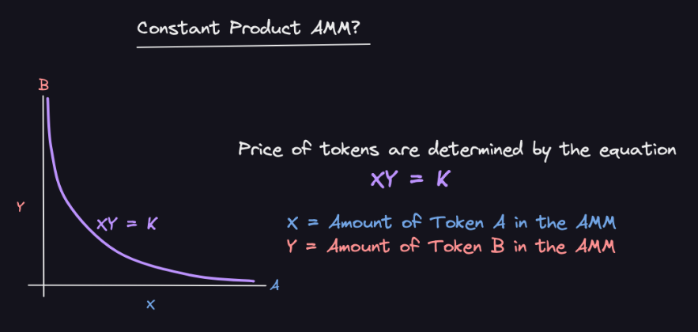

#### Constant Sum AMM
In a constant sum AMM, the sum of the quantity of two assets in a liquidity pool remains constant. When a user wants to trade one token for another, they deposit one token into the pool and receive the other token in return. The price of each token is determined by the ratio of the number of tokens in the pool, as well as the sum of the tokens in the pool.

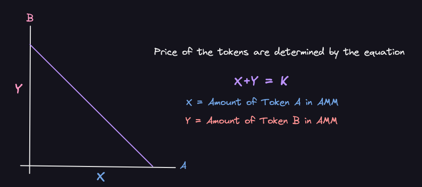

#### Hybrid AMM

Hybrid AMMs combine features of both constant product and constant sum AMMs. They allow liquidity providers to set the parameters of the pool, such as the ratio of the two assets in the pool and the sum of the two assets in the pool. The price of each token is determined by the ratio of the number of tokens in the pool, as well as the sum of the tokens in the pool.

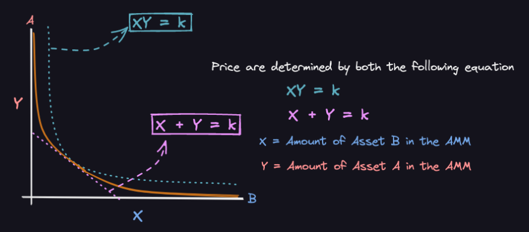

## Concentrated Liquidity

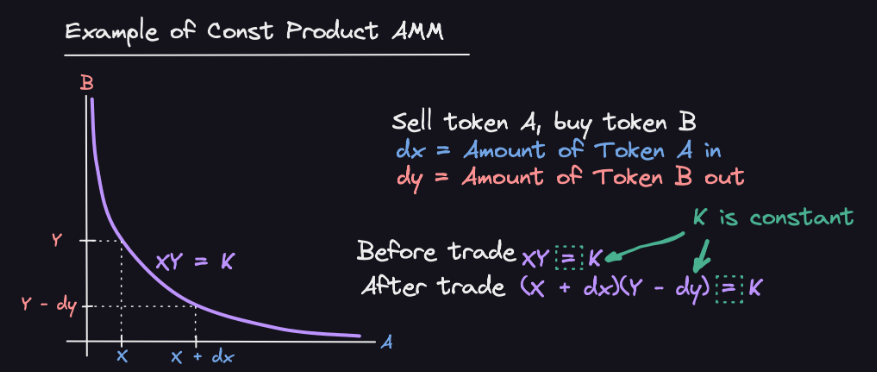

### Limitation of Constant Product AMMs
- Capital Inefficiency: liquidity is spread evenly across the entire price curve. This means that a significant portion of the deposited assets may not be actively used for trading, making the capital usage inefficient. 
- Slippage: Constant Product AMMs use a simple x * y = k formula to determine token prices, which can result in significant slippage (price change due to trade size) for large trades. As the liquidity pool size increases, slippage decreases, but it is still a concern for large orders. 
- Limited Customization: Constant Product AMMs do not offer much flexibility for liquidity providers in terms of customizing their exposure to different tokens or price ranges.

#### What is Concentrated Liquidity AMM?
Concentrated liquidity AMM is a new approach to decentralized trading that allows people to provide liquidity to a market more efficiently. Here's a simple explanation:

-   In traditional AMMs, people deposit two tokens in equal value to create a liquidity pool. This pool is used to facilitate trading between those two tokens.
-   In the case of concentrated liquidity AMM, people can choose a specific price range where they want to provide liquidity, instead of spreading it evenly across all possible prices.
-   By focusing their funds on a smaller price range, they can have a more significant impact on that range, which means their money is being used more effectively.
-   This approach helps reduce the risk of impermanent loss, as it gives choice to the user over what range do they want to deposit the liquidity.
-   Concentrated liquidity AMM also allows for better price stability and reduced slippage, which is the change in price when a trade is executed. This is important because high slippage can lead to unfavorable trade outcomes.

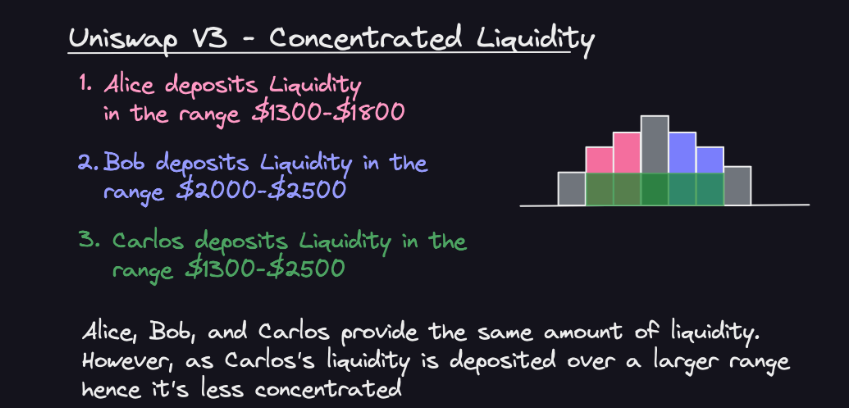

### Impermanent Loss

Impermanent loss is a temporary loss of value that liquidity providers (LPs) can experience when participating in decentralized finance (DeFi) platforms, specifically in automated market-making (AMM) pools. It occurs when the relative prices of the assets in the pool change compared to the initial ratio at which they were deposited.

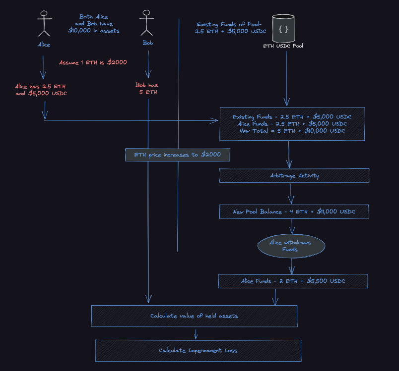

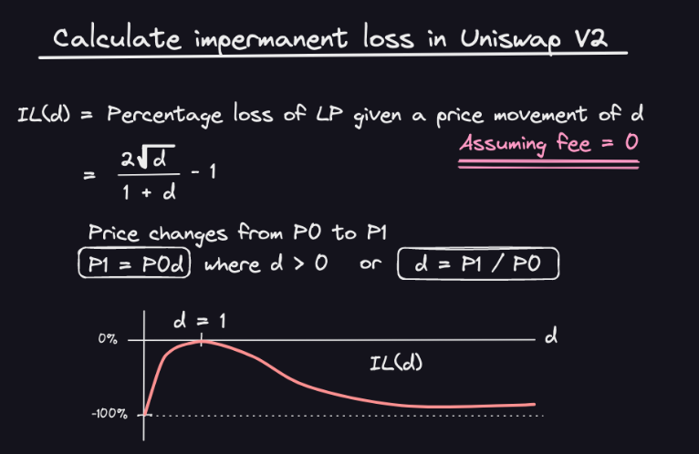

#### Factors Impacting Impermanent Loss

-   Price volatility: The greater the price volatility of the assets in a liquidity pool, the higher the potential for impermanent loss. As the prices of the assets in the pool diverge, the value of the LP's position can become less than if they had simply held onto the assets.
-   Asset correlation: The degree to which the assets in the liquidity pool are correlated can also impact impermanent loss. If the assets are positively correlated, their prices will generally move in the same direction, potentially reducing impermanent loss. However, if the assets are negatively correlated or have no correlation, their prices may diverge more, increasing the risk of impermanent loss.
-   Time in the pool: The duration for which a liquidity provider keeps their assets in the pool can impact impermanent loss. Generally, the longer an LP's assets stay in the pool, the greater the chance that the assets' prices will diverge, leading to impermanent loss. However, it's essential to note that impermanent loss can also be mitigated over time as fees earned from the pool can offset the loss.

#### How to reduce Impermanent Loss?
Although impermanent loss is inevitable. However, there are measures that can be taken to mitigate this risk. They are discussed below:

-   Use concentrated liquidity pools: Uniswap V3 offers concentrated liquidity pools where LPs can specify a price range for their assets. By setting a narrower price range, LPs can limit their exposure to impermanent loss, although they may not earn fees if the trading pair's price moves outside the specified range.
-   Choose less volatile token pairs: By providing liquidity to pairs with lower price volatility, such as stablecoin pairs, LPs can minimize the potential for impermanent loss due to their lower price fluctuations.
-   Monitor the market and adjust your strategy accordingly: Keeping an eye on market conditions and adjusting your strategy as needed can help reduce the risk of experiencing impermanent loss on Uniswap V3.
-   Utilize risk management tools: Some DeFi platforms offer risk management tools that allow you to set limits on your trades or automatically adjust your positions to minimize the risk of loss. These tools can also be helpful when trading on Uniswap V3. It is important to be aware of the security risks associated with using third party tools.

### Liquidity Pool Details

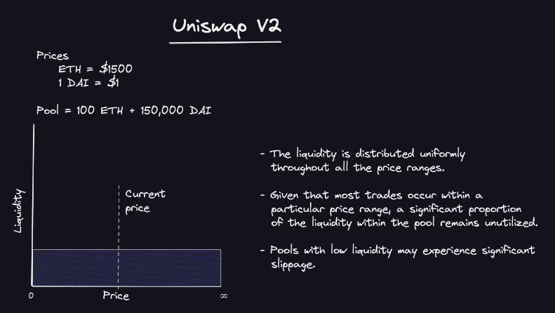

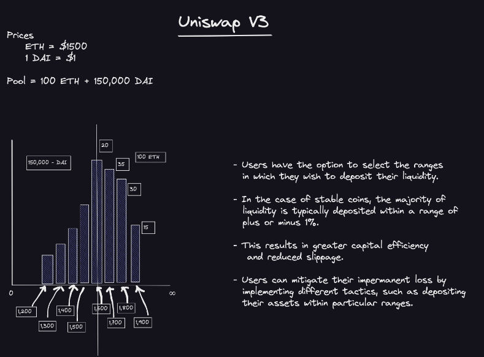

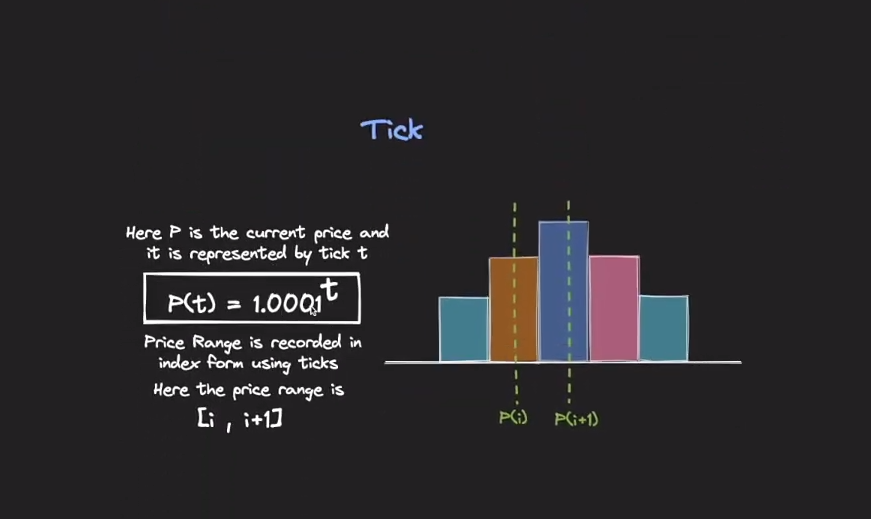

#### Real and Virtual Reserves
In Uniswap V3, the concepts of real and virtual reserves are used to manage liquidity within a pool. Let's break down these terms in simple words and provide an example to illustrate their roles.

Real reserves: Real reserves are the actual amounts of the two tokens held in a liquidity pool. When liquidity providers (LPs) add or remove liquidity, they directly affect the real reserves. The real reserves are used to calculate the exchange rate between the two tokens in a pool, following the constant product formula (x * y = k).

Virtual reserves: Virtual reserves are a mathematical concept used to determine how much liquidity is available for trading within the current price range. They are not actual tokens held in the pool but rather a representation of the liquidity that is active within a specific price range. Virtual reserves help calculate the effective exchange rate and slippage for trades within the given range.

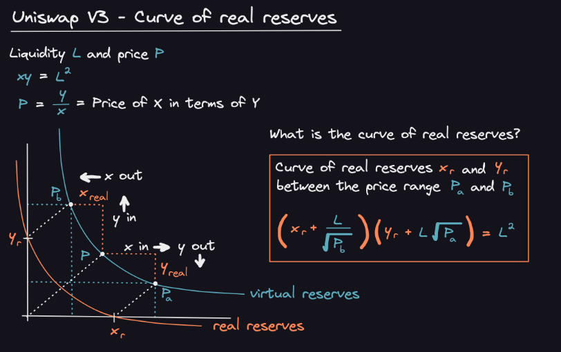

Example
Let's consider another example using the Uniswap V3 ETH/USDC pool. In this case, we'll use specific real reserve amounts and simulate adding liquidity within a certain price range.

Assume the ETH/USDC pool has the following real reserves:

```
Real reserves: 50 ETH and 100,000 USDC (Initial Value)
```
Now, a liquidity provider (LP) wants to add liquidity within the price range of 1,800 USDC/ETH to 2,200 USDC/ETH. They decide to add 10 ETH and 20,000 USDC within this range.

After adding the liquidity, the pool's real reserves will be updated:

```
Real reserves: 60 ETH (50 + 10) and 120,000 USDC (100,000 + 20,000)
```
However, only the added liquidity by the LP falls within the specified price range (1,800 to 2,200 USDC/ETH). Therefore:

```
Virtual reserves: 10 ETH and 20,000 USDC (the liquidity active within the price range)
```
When a user wants to swap tokens within the 1,800 to 2,200 USDC/ETH price range, the virtual reserves (10 ETH and 20,000 USDC) will be used to determine the exchange rate and potential slippage for their trade. Trades outside of this price range will not have access to the virtual reserves and may experience higher slippage or fail due to lack of liquidity.

