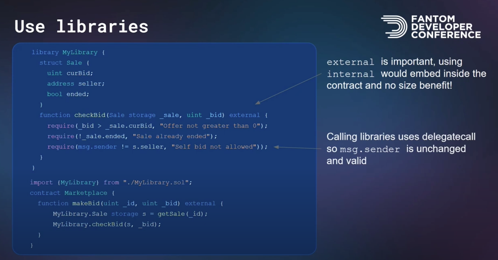
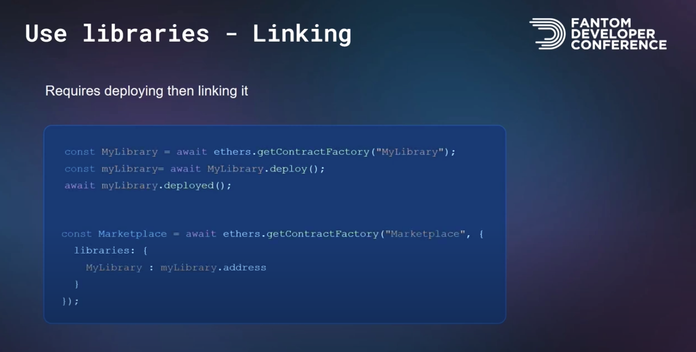

Ubuntu Subsytem

mkdir GlobalLogic
cd GlobalLogic
mkdir learnHardhat
cd learnHardhat
code .

Install WSL: Remote Extension on VS Code

--npm commands--
1. npm install --save-dev hardhat
2. npx hardhat
3. npm install --save-dev dotenv prettier prettier-plugin-solidity solhint @nomiclabs/hardhat-ethers@npm:hardhat-deploy-ethers ethers hardhat-deploy hardhat-contract-sizer
4. 4.npm install -g hardhat-shorthand


--yarn commands--
4. yarn init -y
5. yarn add --dev hardhat
6. yarn hardhat // Choose Typescript Project
7. Do you want to install some packages? Yes
8. yarn add --dev dotenv prettier prettier-plugin-solidity solhint @nomiclabs/hardhat-ethers@npm:hardhat-deploy-ethers ethers hardhat-deploy hardhat-contract-sizer
9. yarn global add hardhat-shorthand

Delete Lock.sol, Deploy.ts and Lock.test.ts

Install VS Code Extensions

1. Prettier- Code Formatter by Prettier
2. Solidity by Nomic Foundation

CTRL + SHIFT + P or COMMAND+SHIFT+P
Type settings
Select Open User Settings(JSON)
Update Settings.json with vscode_settings.json

Create .prettierrc and .prettierignore
.prettierrc

```
{
"useTabs": false,
"semi": false,
"singleQuote": false,
"tabWidth": 4
}
```

.prettierignore

```
node_modules
.env
coverage
coverage.json
typechain
typechain-types

#Hardhat files
cache
artifacts
```

// Optional Libararies

yarn add --dev @chainlink/contracts
yarn add --dev @openzeppelin/contracts
yarn add --dev @pinata/sdk
yarn add --dev base64-sol

hh compile
hh deploy
hh test
hh test --grep players
hh coverage
hh deploy --network rinkeby
hh run scripts/enter.ts --network rinkeby

//Git Commands
// if git is in older version follow the commands to upgrade in linux
git --version
sudo add-apt-repository -y ppa:git-core/ppa
sudo apt-get update
sudo apt-get install git -y
git --version
// Git Repo Commands
git init -b main
git add .
git commit -m "initial commit"
git remote add origin https://github.com/SrikanthAlva/hardhat-fund-me-ts.git
git remote -v
git push origin main

////////////////////////////////
//Additional Scripts from Hardhat Fundme File
yarn hardhat compile
yarn add --dev prettier prettier-plugin-solidity
yarn add --dev dotenv

yarn add --dev solhint
yarn add --dev @chainlink/contracts // For AggregatorV3 Contract
yarn add --dev hardhat-deploy
yarn add --dev @nomiclabs/hardhat-ethers@npm:hardhat-deploy-ethers ethers // picks contracts to deploy from the deploy folder in series

yarn add --dev @nomiclabs/hardhat-etherscan // Its pre installed with "yarn hardhat"
yarn add --dev hardhat-gas-reporter // Its pre installed with "yarn hardhat"
yarn add --dev solidity-coverage // Its pre installed with "yarn hardhat"

yarn solhint --init
yarn solhint 'contracts/_.sol'
yarn solhint 'contracts/_.sol' --fix // Fix Solidity Lint Issues

yarn prettier --write . // Fix Formating with prettier
yarn hardhat coverage // Generate Test Coverage Report

yarn hardhat compile

yarn hardhat deploy // Deploys to local hardhat based on files in deploy folder in series
yarn hardhat deploy --tags mocks // Deploys only files tagged as "mocks"
yarn hardhat deploy --network rinkeby //Deploys to rinkeby testnet

yarn hardhat test // Runs tests on local hardhat network
yarn hardhat test --grep funded // Runs onlyTests with description "funded" in it
yarn hardhat test --network rinkeby // Runs tests on rinkeby testnet

yarn hardhat node // Start persistant hardhat node
// On a New Tab
// yarn hardhat run scripts/fund.ts --network localhost // Executes scripts on persistant hardhat node
// yarn hardhat run scripts/withdraw.ts --network localhost // Executes scripts on persistant hardhat node

////////////////////////////////
//Additional Scripts from Simple Storage File
yarn hardhat run scripts/deploy.ts // deploys to local hardhat
yarn hardhat run scripts/deploy.ts --network hardhat
yarn hardhat run scripts/deploy.ts --network rinkeby
yarn hardhat // List hardhat commands available
yarn hardhat block-number // Execution of new task block-number local hardhat
yarn hardhat block-number --network rinkeby // Execution of new task block-number rinkeby
yarn hardhat node // Creates a persistent hardhat node with 10 accounts
yarn hardhat console --network localhost // Allows to intreact with nodes using command line
yarn hardhat clean // Delets Artifacts Folders
yarn hardhat test // Executes Tests
yarn hardhat test --grep store // Executes tests with description "store"
yarn hardhat coverage // Generates code coverage report

New Try

yarn init -y
yarn add --dev hardhat
yarn hardhat // Choose Empty HardhatConfig file

yarn add --dev "hardhat@^2.9.9" "@nomicfoundation/hardhat-toolbox@^1.0.1" "@nomicfoundation/hardhat-network-helpers@^1.0.0" "@nomicfoundation/hardhat-chai-matchers@^1.0.0" "@nomiclabs/hardhat-ethers@^2.0.0" "@nomiclabs/hardhat-etherscan@^3.0.0" "chai@^4.2.0" "ethers@^5.4.7" "hardhat-gas-reporter@^1.0.8" "solidity-coverage@^0.7.21" "@typechain/hardhat@^6.1.2" "typechain@^8.1.0" "@typechain/ethers-v5@^10.1.0" "@ethersproject/abi@^5.4.7" "@ethersproject/providers@^5.4.7" "@types/chai@^4.2.0" "@types/mocha@^9.1.0" "@types/node@>=12.0.0" "ts-node@>=8.0.0" "typescript@>=4.5.0" "dotenv" "prettier" "prettier-plugin-solidity" "solhint" "@nomiclabs/hardhat-ethers@npm:hardhat-deploy-ethers" "ethers" "hardhat-deploy" "hardhat-contract-sizer"


## Tips to reduce smart contract size

`yarn add hardhat-contract-sizer`

update hardhat.config.ts with the following code 
`
    contractSizer: {
        alphaSort: true,
        runOnCompile: true,
        disambiguatePaths: false,
        strict:false
    },
`

Note: Smart Contract Size cannot be more than 24576 bytes [a limit introduced in Spurious Dragon Update]

1. use private variables
2. storage slot packing
3. move logic into a new contracts (check this with caution, sometimes it increases the cost)
4. Move modifier logic into a function
5. Memory layout conditions using dynamic storage - Use Custom Errors
6. Use Libraries

7. Use Libraries - Linking (Explore more on this)

8. Enable Optimization (200-350 runs is optimal)
    - Common Misconception: A Higher Number means number of passes.
    - Reality: The number means how many times the smart contract is called. Ths compiler will do as many passes as is possible.