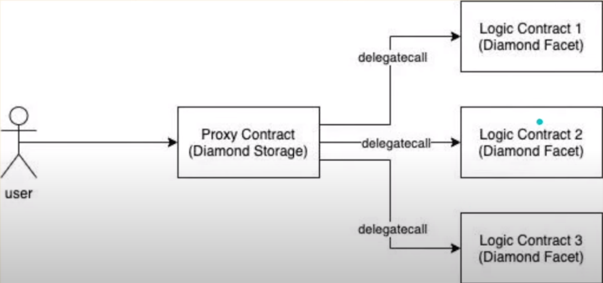
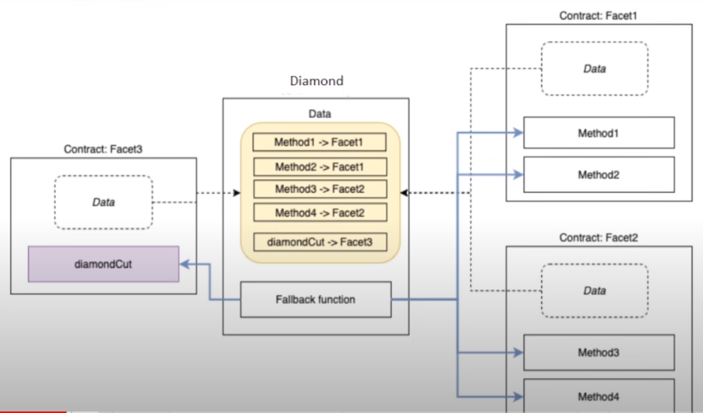

# Types of Proxy Patterns

- Transparent Proxy
- UUPS Proxy
- Beacon Proxy
- Diamond Proxy

# Diamond Proxy - EIP 2535



- Diamond Proxy Pattern is proxy design pattern that enables modularity and upgradeability of smart contracts.
- They store the data of the smart contract and use the solidity fallback function to make "delagate calls" to facets that contain the actual logic.
- A Smart Contract that implements this standard is known as a Diamond, and the contracts that provide different functonalities to the diamond are known as Facets.



## Features

- Smart Contract Upgradeability
- Unlimited Functionality Smart Contracts
- No Smart Contract Code Size Limit
- Modular and Structural arrangement of code and data
- Developers can add multiple facets to a diamond.

## Architecture

- The Diamond
    - The Central Contract that acts as a proxy and routes function calls to the approriate facets. It contains a mapping of function selectors to facet addresses.
- Facet
    - Individual contracts that implement specific functionality. Each facet contains a set of functions that can be called by the diamond.
- Loupe
    - A set of standard functions defined in EIP-2535 that provide information about the facets ad function selectors used in the diamond. the diamond loupe allows developers and users to inspect and understand the structure of the diamond.
- Diamond Cut - FacetCutAction
    - function used to add, replace, or remoce facets and their corresponding function selectors in the diamond. Only an authorized address can perform a diamond cut.
- The Diamond Storage & App Storage

## Sample Contract

```solidity
// SPDX-License-Identifier:MIT

contract Main {
    uint256 public verySpecialVar;
    uint256 public notSoSpecialVar;

    function setVerySpecialVar(address _specialVarManager) external {
        _specialVarManager.delegatecall(abi.encodeWithSignature("writeSpecialVar()"));
    }


    function setNotSoSpecialVar(address _notSpecialVarManager) external {
        _notSpecialVarManager.delegatecall(abi.encodeWithSignature("writeNotSpecialVar()"));
    }

}

contract SpecialVarManager {
    uint256 verySpecialVar;
    function writeSpecialVar() external {
        verySpecialVar = 100;
    }
}

contract NotSpecialVarManager {
    uint256 notSoSpecialVar;
    function writeNotSpecialVar() external {
        notSoSpecialVar = 50;
    }
}


```

## Solidity Tips

- Solidity does not care about what you name your varibales; it only looks at the storage slot position.
- all of the storage of our state variables is kept in Diamond.sol. Facets do not store the state variables and data of the diamond.
- we need a way to organize our state variables so that we are not overwriting our storage slots.
- total storage slots are 2^256
- Diamond Pattern - hash a unique value, we will get a random storage slot that will almost certainly not collide with another storage slot and we share variables between the two smart contracts
- hash a uniue value, we will get a random storage slot that will almost certainly not collide with another storage slot.
- same process solidity uses to store mappings and dynamic arrays.


[Awesome Diamonds Gitub](https://github.com/mudgen/awesome-diamonds)
[Diamond GitHub](https://github.com/mudgen/diamond)
[Diamond 3 GitHub Boilerplate](https://github.com/mudgen/diamond-3-hardhat)