# Starknet

Starknet is an L2 Protocol on Ethereum

1. Ethereum : Starknet
2. Solidity : Cairo
3. Foundry  : Startnet Foundry
4. Metamask : Argent X, Bravos
5. npm,Yarn : Scarb

# Common Terms

- Starkware - Company
- Starknet - L2 Rollup Permissionless
- StarkEx - L2 Rollup Permissioned - L2 Validium
- Starknet Foundation - Non Profit Organization

# Why Cairo?

- Cairo is a CPU Architecture designed to optimize for proof systems.
- Enable Trustless Cooperation.
- execute => result + proof
- if the execution is intentionally or unintentionally modified, the proof will be invalid.
- A regular computer is able to keep the SuperComputer Honest 
--- 
- Helps to create provable programs
- Runs on top of CairoVM
- Syntax inspired by Rust
- Similar ownership model
- Strongly typed
- can be used outside of Starknet
- No need to know ZK!


# Why Cairo?

- Creates `provable` programs
- Proof of computational integrity
- Verfiication `without` re-execution
- Powerful & flexible language
- Prevents cheating and malfunction
- Keeps a supercomputer `honest`

```
Comptutional Integrity - you can prove that output of certain computation is correct, right, without having to run the computation by itself.
```


# Why Starknet?

## L1 Scaling Problem

L1 Block Verification is slow as the validators have to verify the complete block details. 

In Case L2's with the Block creation an additonal proof is generated.
Validators only have to verfiy the proof, which is much smaller and faster than verfiying the complete block. Thus, improving the scalability of the overall system.

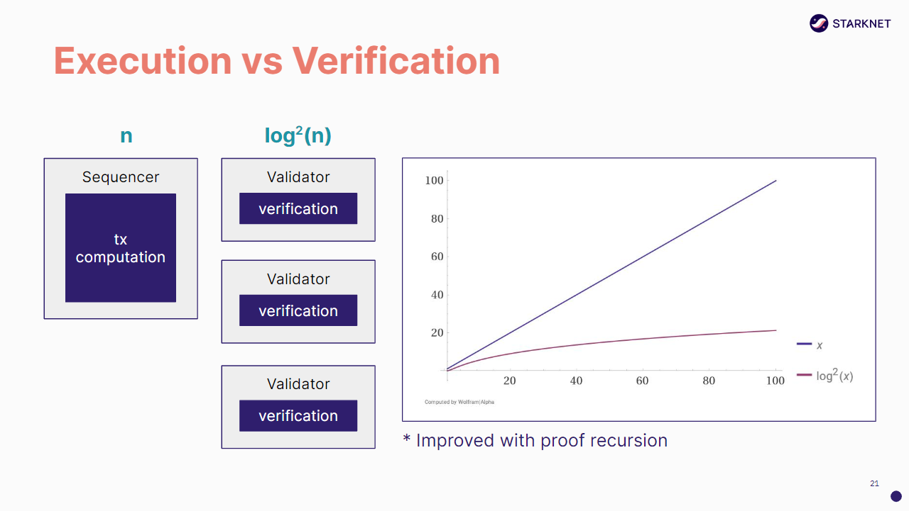

# Validity Proofs

Validity Proofs reduces computational time similar to ziping will reduce file size

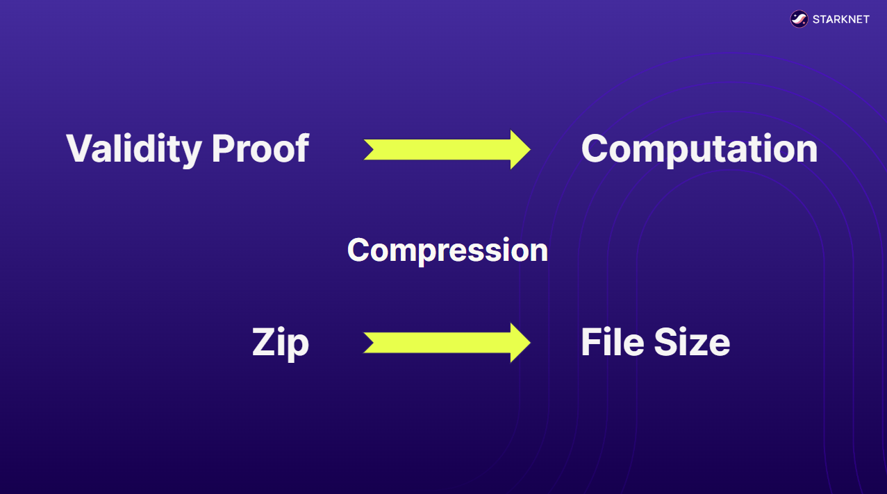

- A use case of Zero Knowledge Proofs
- Used for compression, not privacy
- If `output` is result of `program + inputs`
- Output can be verified without inputs
- Validity Proofs => Validity Rollup
- Based on STARKs, not SNARKs
- Efficient proving and verification

## STARK vs SNARK
- STARK - Scalable Transparent Arguments of Knowledge
- SNARK - Succint Non-Interactive Arguments of Knowledge

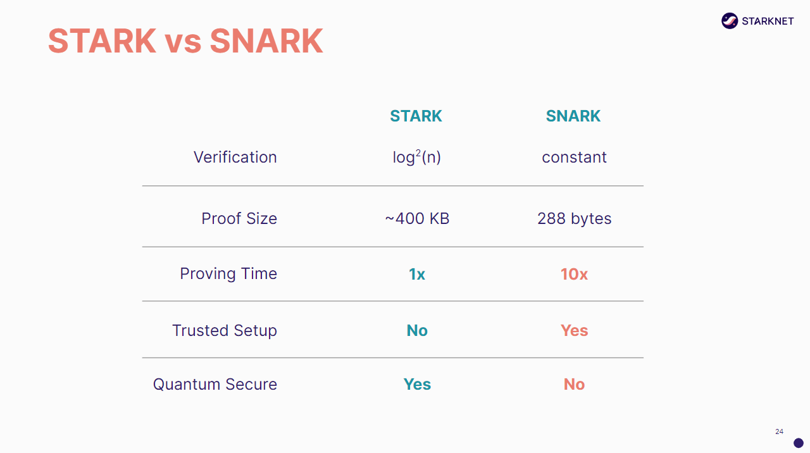

# Why CairoVM and not EVM?

- CairoVM optimizes `Performace`
- ZKEVM optimizes `Compatibility`

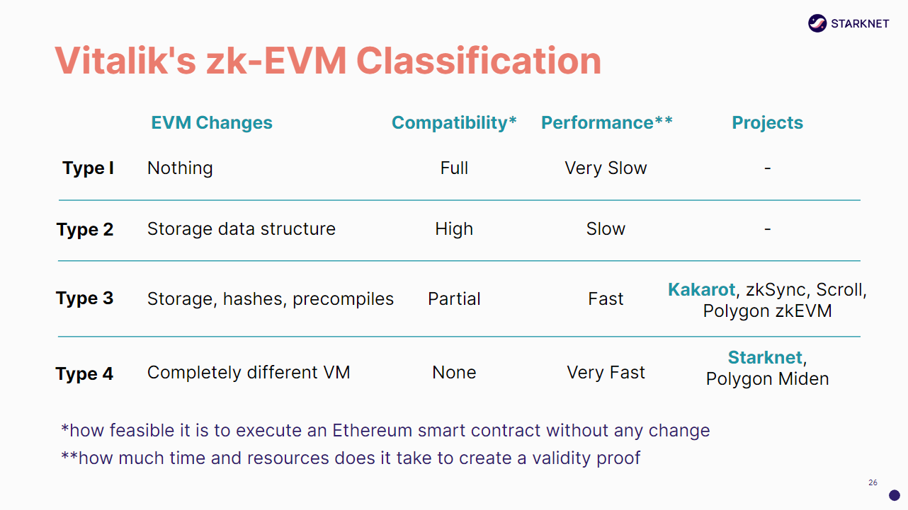


# Why Starknet?

- Optimized for ZK tech
- ↑ computing power ↓ gas fees
- Secured by STARKs + Ethereum
- Powerful programming language
- Battled tested tech stack (2y | $1T)
- Withdraw assets to L1 in ~10h
- No trusted setup

# Deep Dive

## Cairo 0

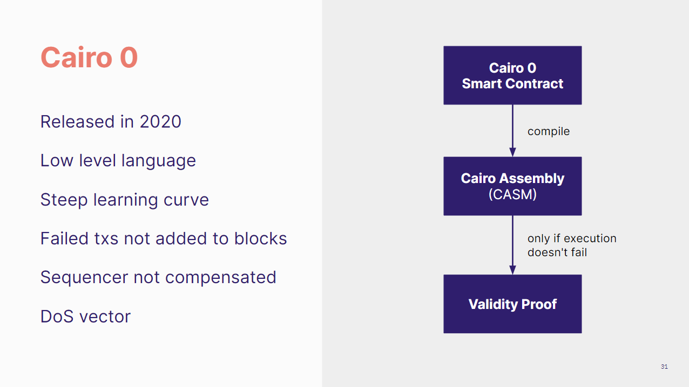

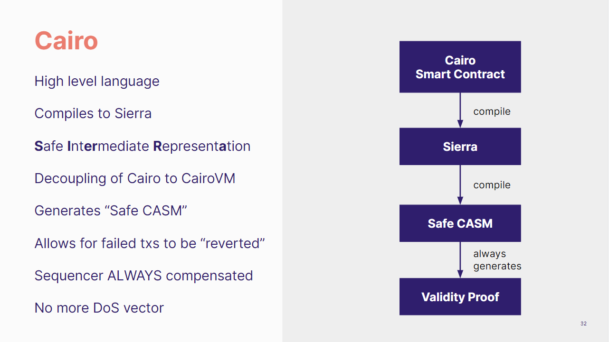

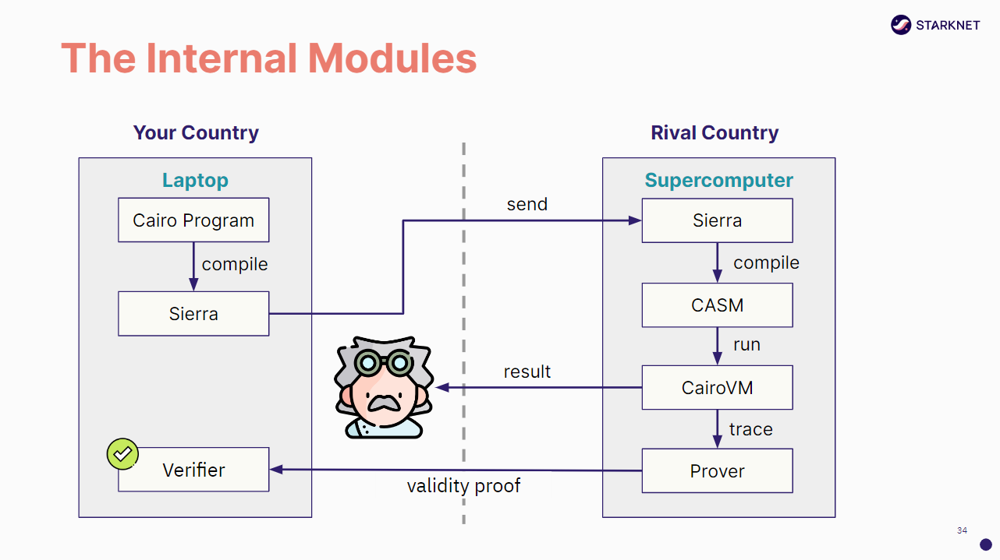

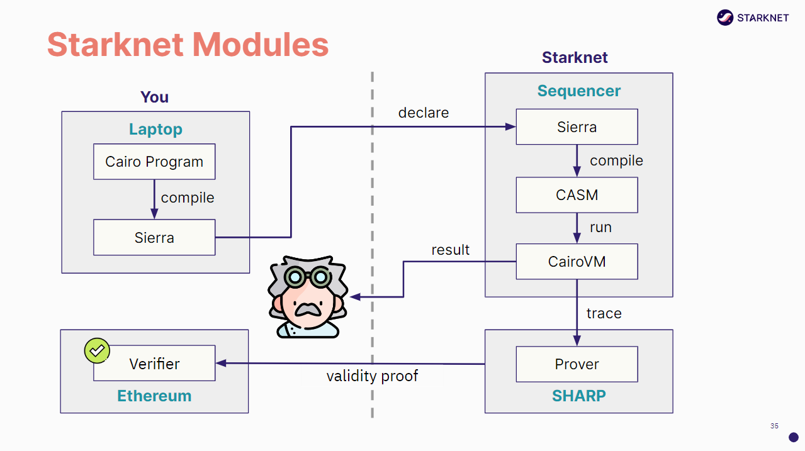

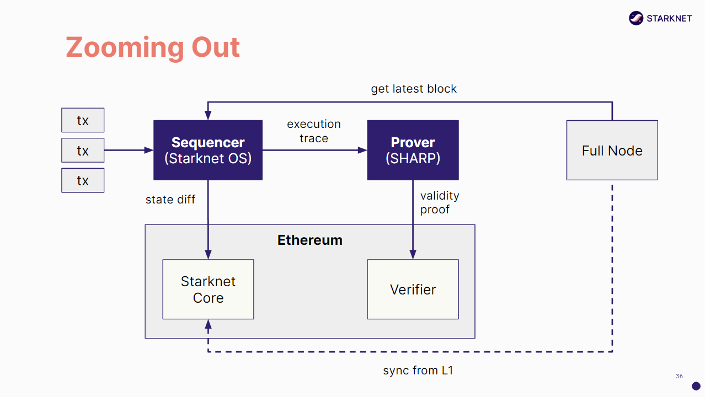

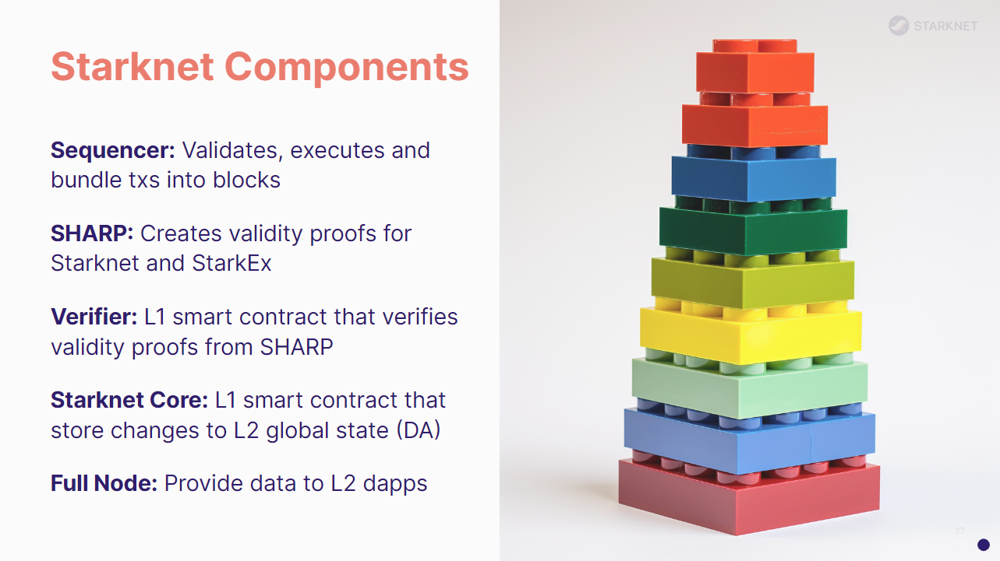

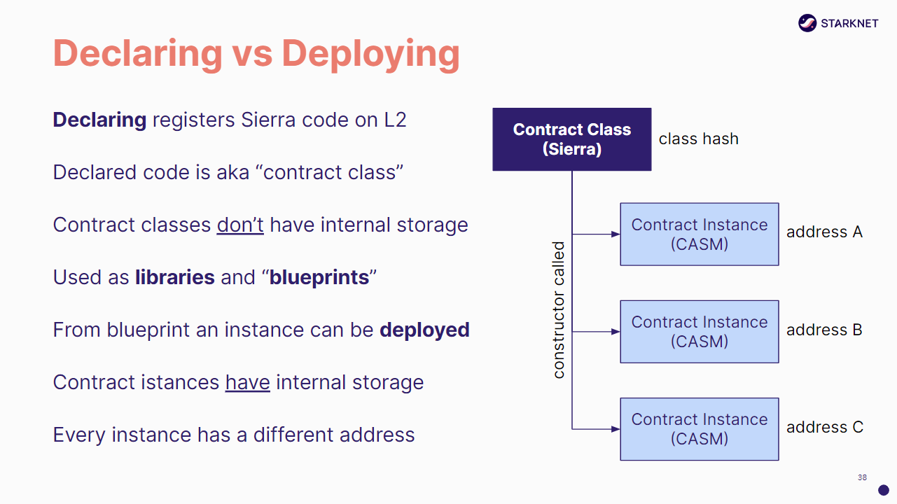

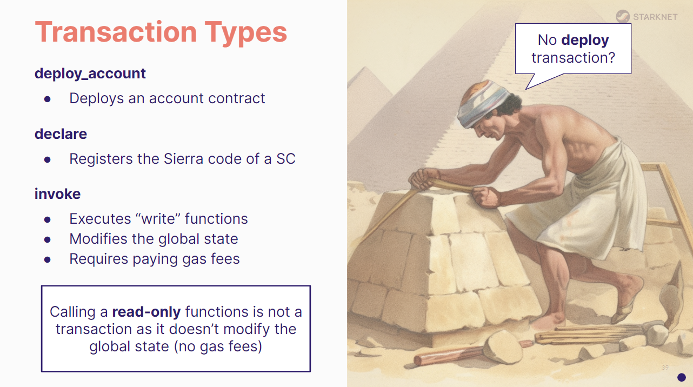

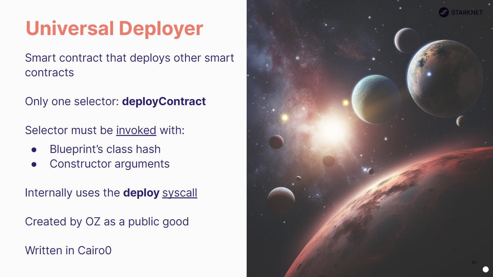

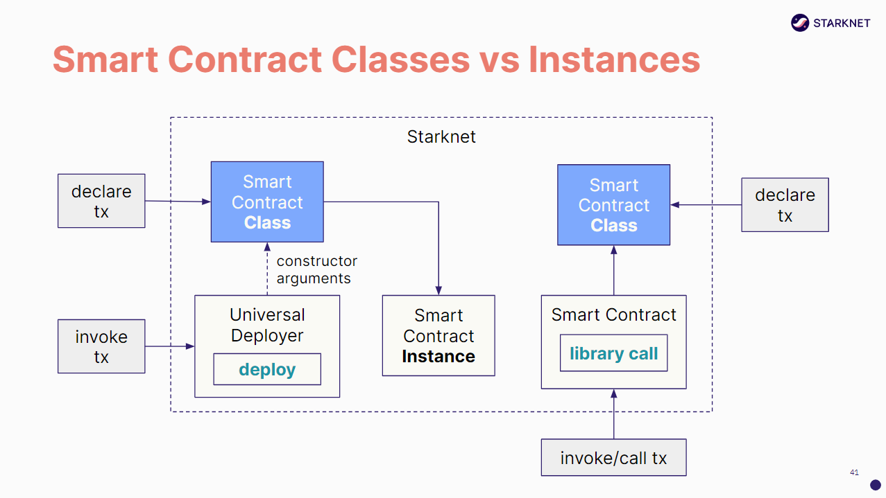

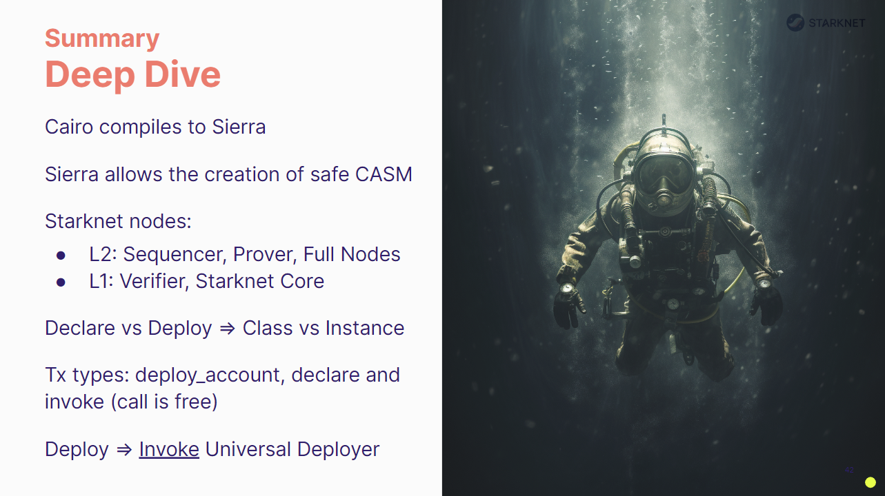