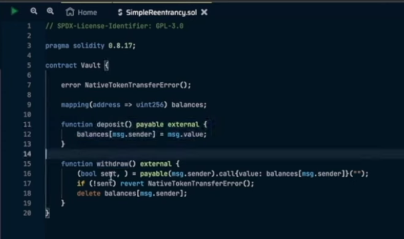
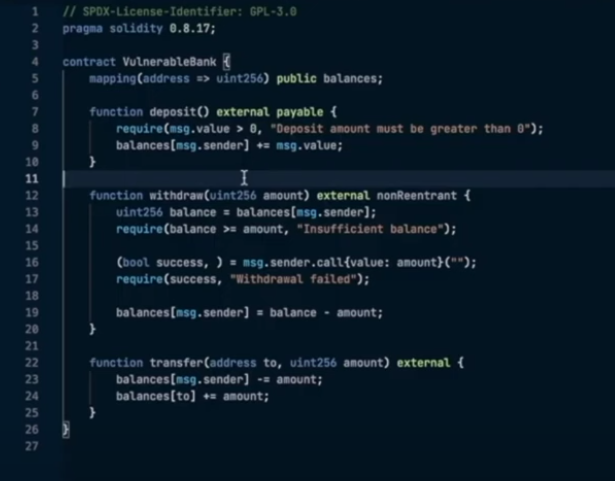
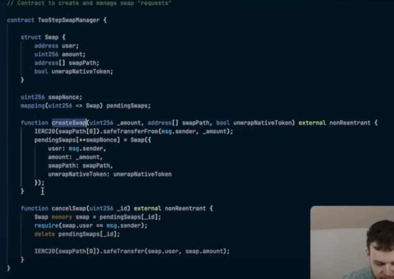
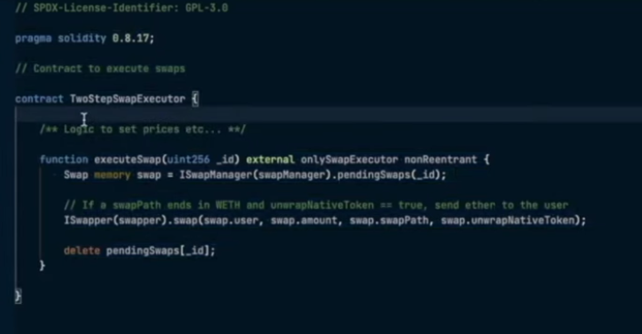

# Web3 Security

## Principles of Smart Contract Design

- Less Code 
    - if possible write less code as possible
- Storage Variable 
    - Be very picky about using storage variables
- If a logic can be handled off-chain, keep it off-chain
- Avoid Loops as much as possible
- Limit Expected Inputs
    - Restrict User Action to only provide valid values; use excess validations
- Handle All Cases
- Avoid Parallel Data Structures [Two Pieces of storage or memory that are tracking the thing]
    - `mapping(address => Position)posMapping; Position[] positions;`
    - Consider if necessary, can you use EnumerableMapping, EnumerableSet
- External Calls
    - Reectrancy Issues
        - CEI => Check Effect Interaction
        - Make all functions Non Reentrancy (Ideally)
        - Read Only Reentrancy [Multiple Contract Reentrancy]
    - DOS
    - Return Values
        -   Check for all possible values
        -   Unexpected Bytes
    - Gas
        -   In not trusted => dont forward all the gas
    - Post Checks
    - Good Documentation [Blueberry-Core Audit](https://github.com/sherlock-audit/2023-05-blueberry/tree/main/blueberry-core#readme)
    - External Call Safety
        -   Use Global Reentrancy Guards [Check GMX V2  Protocol]

## Reentrancy Guide

### Canonical Classic Reentrancy

- CEI - Check Effects and Interaction
- Use Reentrancy Guards

### Cross Function Reentrancy

### Cross Contract Reentrancy

### Read-only Reentrancy

